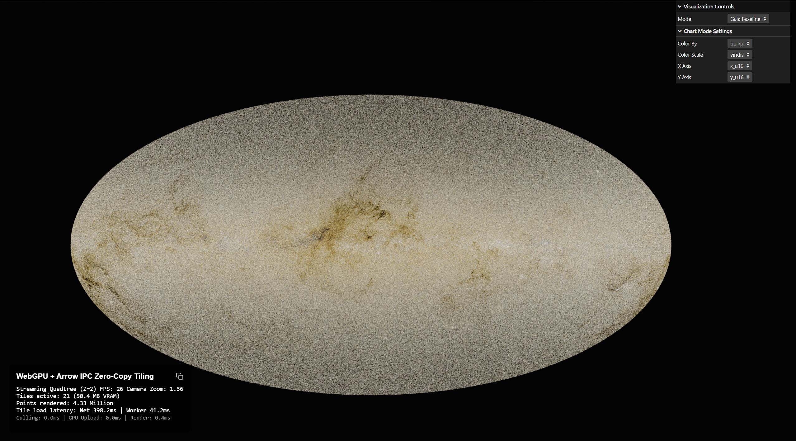
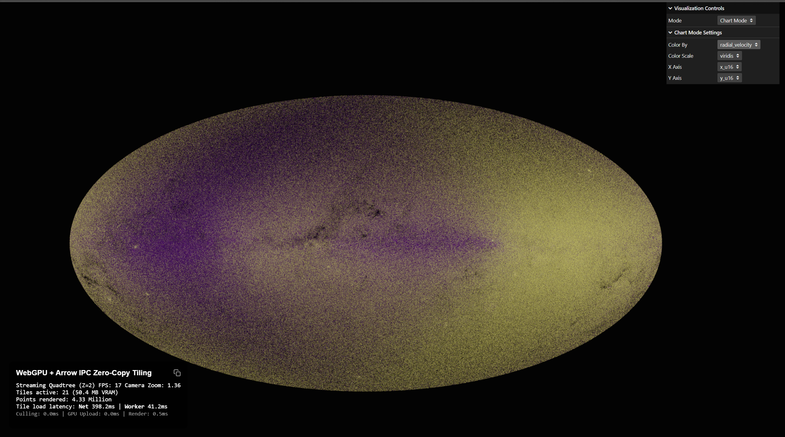
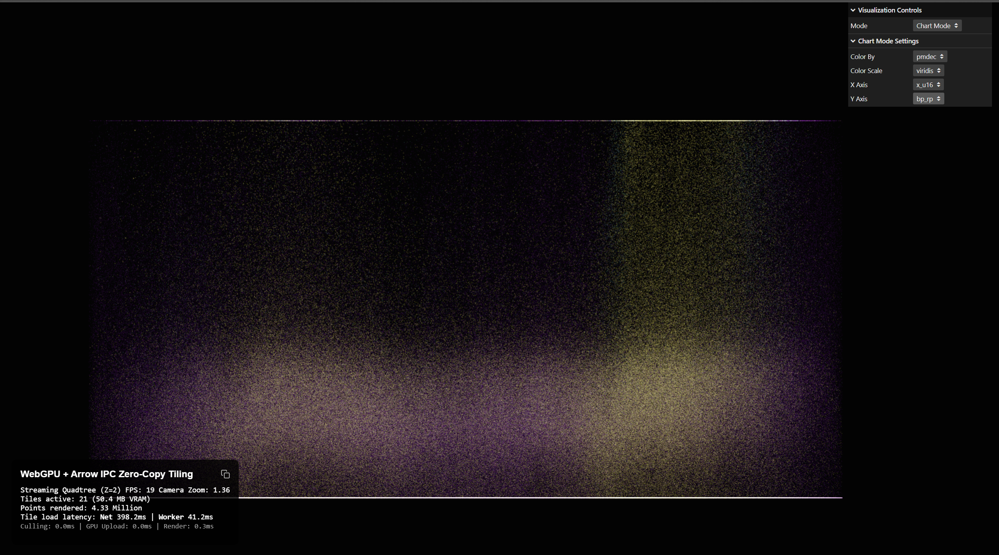
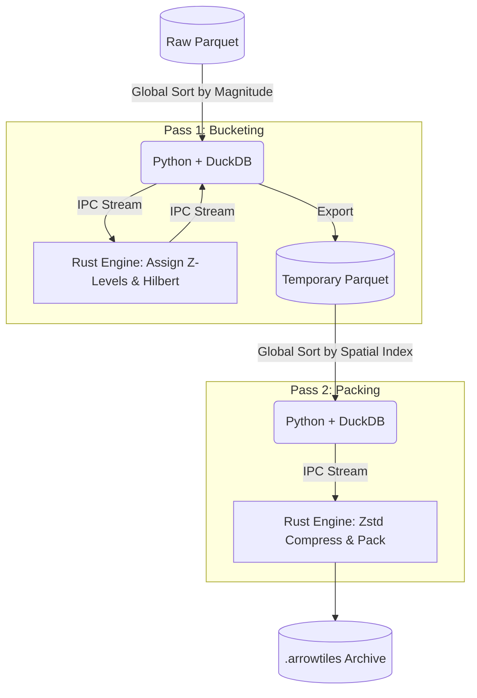

# ArrowTiles Pipeline (DuckDB + Rust IPC)

[](https://duckdb.org)
[](https://www.rust-lang.org/)
[](https://www.python.org/)

ArrowTiles is a high-performance data engineering pipeline designed to process massive, out-of-core spatial datasets (like the 1.8 billion row ESA Gaia dataset) and pack them into strictly ordered, Apache Arrow IPC-encoded `.arrowtiles` (PMTiles) archives.

Because statically compiling a DuckDB extension via Rust on Windows can cause MSVC standard library conflicts, this pipeline uses a decoupled **Python + Rust IPC (Inter-Process Communication)** architecture. Python orchestrates DuckDB's out-of-core sorting engine, while a dedicated Rust binary handles CPU-intensive spatial math and parallel Zstandard compression.

## 🚀 Performance
The 2-pass IPC architecture completely bypasses FFI (Foreign Function Interface) memory leaks and maximizes CPU utilization. It is capable of processing **1.35 billion rows** on consumer hardware (64GB RAM, 24-core CPU) in **1 hour and 17 minutes**, yielding a tightly compressed 29.5 GB `.arrowtiles` archive optimized for WebGPU HTTP Range Requests.

### European Space Agency GAIA v3 Benchmarks
Here are the actual hardware metrics captured during the build of the 1.8 billion row Gaia v3 dataset:








## 🏗️ The 2-Pass Architecture

To prevent out-of-memory (OOM) crashes and preserve 60 FPS rendering in the frontend browser, the pipeline strictly separates spatial indexing from chunk compression:



### Pass 1: Global Magnitude Bucketing
1. DuckDB reads the raw dataset and sorts it globally by absolute magnitude (brightness) in ascending order.
2. The ordered rows are piped to the Rust engine, which uses a density map to assign a Quadtree Z-level and a spatial Hilbert index to each point.
3. The enriched rows are streamed back to DuckDB and saved as a temporary Parquet file (`duckdb_temp/bucketed_temp.parquet`).

### Pass 2: Spatial IPC Packing
1. DuckDB reads the temporary Parquet file and sorts it globally by `Z-Level` and `Hilbert Index`.
2. The perfectly ordered spatial data is piped to the Rust engine.
3. Rust strips the redundant Arrow IPC schema headers (saving ~12% archive size), parallelizes Zstd compression across all CPU cores using Rayon, and limits chunks to 500k rows to prevent client-side memory spikes.
4. Rust injects the base64-encoded Arrow schema into the final PMTiles JSON metadata.

---

## 🛠️ Building & Setup

### 1. Prerequisites
- **Python 3.10+**
- **Rust Toolchain** (cargo)
- **DuckDB CLI** (or Python package)

### 2. Python Environment
Install the required python orchestration dependencies (`pyarrow`, `duckdb`, `tqdm`):
```bash
pip install -r requirements.txt
```

### 3. DuckDB Extensions
This pipeline relies on the community `lindel` extension for Hilbert curve generation. You can install it directly inside your DuckDB environment:
```sql
INSTALL lindel FROM community;
LOAD lindel;
```

### 4. Build the Rust Engine
Compile the highly optimized Rust ArrowTiles engine. **You must compile in release mode** to achieve acceptable throughput:
```bash
cd arrowtiles-engine
cargo build --release
```
*(The Python script expects the compiled binary to be located at `target/release/arrowtiles_engine.exe`)*

---

## ⚙️ Usage & Configuration

Once the Rust binary is compiled, you execute the Python orchestrator to begin the 2-pass build process:

```bash
python arrowtiles.py --input "path/to/raw/*.parquet" --output "gaia.arrowtiles"
```

### CLI Arguments
| Argument | Description |
| :--- | :--- |
| `--input` | (Required) Glob path to the input Parquet files. |
| `--output` | (Required) Path where the final `.arrowtiles` archive will be written. |
| `--dataset` | (Optional) `gaia` (default) for astronomical Hammer projection, or `generic` for arbitrary tabular datasets mapped via `--x-col` and `--y-col`. |
| `--x-col` | (Optional) The column name for X coordinates when using generic dataset (defaults to `x_norm`). |
| `--y-col` | (Optional) The column name for Y coordinates when using generic dataset (defaults to `y_norm`). |
| `--sort-col` | (Optional) The column to globally sort by for LOD/culling (defaults to `abs_m`). |
| `--resume` | (Optional) Skips Pass 1 and resumes directly from the `bucketed_temp.parquet` file if it exists. Useful if Pass 2 crashed previously. |

### Input Data Requirements
By default, the `arrowtiles.py` script (`--dataset gaia`) is hardcoded to project the ESA Gaia dataset into Galactic coordinates using a Hammer projection. It expects the input Parquet files to contain at minimum:
- `ra`, `dec` (Right Ascension / Declination)
- `magnitude` (Absolute brightness, used for LOD sorting)
- *Additional astronomical columns (parallax, pmra, pmdec, radial_velocity)*

For non-astronomy datasets, use `--dataset generic` combined with `--x-col`, `--y-col`, and `--sort-col` to map standard spatial data directly without astronomical conversions.

### Embedded PMTiles Schemas (Self-Describing Tiles)
During the Rust `arrowtiles-engine` packing phase, the backend natively extracts the exact Apache Arrow IPC Schema from the very first binary chunk. 
This schema is Base64-encoded and natively injected directly into the PMTiles JSON metadata under the `"arrow_schema"` key. This turns `.arrowtiles` archives into self-describing spatial data sets—any frontend client can read the global metadata to discover exactly which columns, types, and geometries exist inside the tiles without requiring hardcoded column layouts.

---

## 🗺️ Future Roadmap

While the core pipeline successfully processes billion-row datasets, there are several major architectural leaps planned to transform ArrowTiles from a sandbox tool into a world-class spatial ecosystem.

### Phase 1: Pipeline & Frontend Optimization
- **Z-Level Partitioning (Zero-Wait Packing):** Currently, Pass 2 requires a 20-minute out-of-core spatial sort by DuckDB. We plan to upgrade Pass 1 to partition data into separate Parquet files based on Zoom level (`z_0.parquet`, `z_1.parquet`). This perfectly pre-sorts the Z-axis, turning Pass 2 into a series of lightning-fast, purely in-memory sorts and eliminating the disk-thrashing gap.
- **Multi-Tile Streaming (Layering):** Packing 10 dimensions of scientific data (Velocity, Chemistry, Dust) into a single file makes the `.arrowtiles` archive extremely heavy. We will upgrade the pipeline to generate a lightweight "Core Layer" (XYZ coordinates only) alongside independent "Auxiliary Layers". The frontend WebWorker will fetch active layers concurrently and merge them just-in-time before GPU upload, drastically reducing bandwidth and allowing users to dynamically toggle datasets.

### Phase 2: Open-Source Ecosystem Wrappers
To make the pipeline accessible to the broader data science and web development communities, we plan to wrap the unified Rust engine using industry-standard FFI bindings:
- **Python (PyO3 + Maturin):** Publish to PyPI so astrophysicists and data scientists can generate tiles directly in Jupyter Notebooks without installing Rust: `arrowtiles.build_lake("s3://esa-gaia", "output.arrowtiles")`.
- **Node.js CLI (NAPI-RS):** Publish to NPM so web developers can quickly generate test tiles for WebGPU frontends using a simple terminal command: `npx arrowtiles build <input> <output>`.

### Phase 3: The C++ DuckDB Extension
Once the byte-offset logic, Quadtree math, and schema-stripping algorithms are mathematically perfected and proven in safe Rust, the ultimate goal is to port the logic to C++. By building a native loadable DuckDB extension, anyone in the world will be able to generate WebGPU-ready tiles using standard SQL:

```sql
INSTALL arrowtiles;
LOAD arrowtiles;
COPY (
    SELECT ra, dec, parallax, phot_g_mean_mag 
    FROM 's3://esa-gaia/**/*.parquet'
) TO 'gaia.arrowtiles' (FORMAT ARROWTILES, MAX_CAPACITY 100000);
```

### Phase 4: Production Hardening & Ecosystem
1. **API Genericism & Developer Experience (DX)**
   - **Frontend Declarative Configuration:** Instead of hacking `Scatterplot.ts` to change visual mappings, the frontend should accept a declarative JSON/JS configuration (similar to Vega-Lite). Users should be able to define mapping functions like: `{ x: 'ra', y: 'dec', color: { field: 'temperature', scale: 'viridis' } }` without touching WebGPU TSL code.

2. **Testing, CI/CD, & Cross-Platform Builds**
   - **Automated Integration Testing:** You need a CI pipeline (e.g., GitHub Actions) that runs end-to-end: generating a small dummy dataset in Python -> packing it with the Rust engine -> starting a local HTTP server -> running a headless browser (like Puppeteer/Playwright) to verify the WebGPU canvas renders without crashing.
   - **Cross-Platform Rust Binaries:** Before you can release this to NPM or PyPI, your CI needs to automate the compilation of the Rust engine for Windows (MSVC), macOS (Apple Silicon/Intel), and Linux (GNU/Musl), so users don't have to install the Rust toolchain to use your Python/JS wrappers.

3. **Graceful Degradation & Hardware Scaling**
   - **Dynamic Cache Budgeting:** The `maxCacheSize` in the frontend is currently a static number. A production version should query `navigator.deviceMemory` (if available) or benchmark the initial WebGPU buffer allocation time to dynamically scale the tile cache and LOD threshold based on the client's actual hardware.
   - **WebGL2 Fallback Pipeline:** WebGPU adoption is growing, but it is not ubiquitous (especially on older mobile devices or unsupported browsers). A production library needs a fallback renderer using standard WebGL2 InstancedMesh with simpler shaders, even if it means capping the point count at 5-10 million instead of 100 million.

4. **Observability & Robust Error Handling**
   - **Rust tracing & miette:** Replace the `.unwrap()` calls in your Rayon parallel iterators with Result types. Implement a library like `miette` to provide beautiful, terminal-friendly error messages that tell the user exactly which row or chunk failed (e.g., "Found NaN in column 'magnitude' at index 40592").
   - **Frontend VRAM Telemetry:** Expose an event emitter on the TileManager that broadcasts VRAM usage and dropped frames so host applications can show warnings to the user (e.g., "Your device is running low on memory, reducing visual quality").

5. **CDN & Hosting Infrastructure Guidelines**
   - **S3/CloudFront Tuning:** Production documentation must include explicit Terraform or AWS/GCP configuration guides for setting up CORS headers, `Access-Control-Expose-Headers`, and optimizing Edge caching for byte-range requests. Without this, users will face massive latency spikes or blocked requests when trying to host their `.arrowtiles` files.

### Phase 5: DeepGraph Studio (Visual Front-End for Data Scientists)
A local-first visual desktop application (e.g., built with Tauri + Rust + WebGPU) where data scientists can:
- Drag and drop massive datasets (Parquet, CSV, databases).
- Visually configure coordinate mappings (`X`, `Y`) and color/magnitude scales.
- Build the map using our DuckDB -> Rust Arrowtiles pipeline under the hood.
- Instantly preview the rendered WebGPU map and publish it as a static HTML bundle, democratizing billion-row spatial data for non-programmers.

---

## 📄 Licensing
This project is freely available for non-commercial use under the **Creative Commons Attribution Non Commercial CC BY-NC 4.0** public license. Please note that this license does not permit commercial use of the software. For more information about the limitations of this license, you can refer to the [CC BY-NC 4.0 License Deed](https://creativecommons.org/licenses/by-nc/4.0/).

If you’re planning to use this software commercially, please reach out to us for a Business license.
