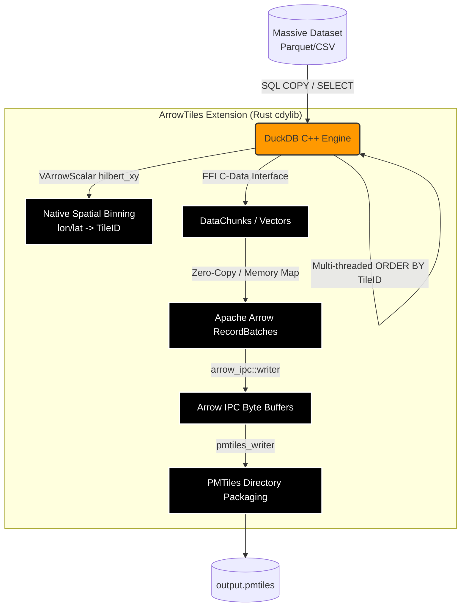

# ArrowTiles (DuckDB Rust Extension)

[](https://duckdb.org)
[](https://www.rust-lang.org/)

ArrowTiles is a highly experimental, high-performance **native DuckDB extension** written in Rust. 

The goal of this project is to eliminate Python and standard IPC overhead from spatial tiling workflows. By running directly inside DuckDB's C++ memory space, ArrowTiles allows data scientists to ingest massive Parquet/CSV datasets and natively export them into a single PMTiles archive filled with dense Apache Arrow IPC buffers—all using a single SQL command.

## 🏗️ Architecture

ArrowTiles leverages `duckdb-rs` and `cargo-duckdb-ext-tools` to bridge the gap between DuckDB's internal C++ execution engine and the modern Rust geospatial ecosystem (`arrow-rs` and `pmtiles-rs`).



## 🚀 Phases & Roadmap

### ✅ Phase 1: Extension Skeleton & DuckDB Interop (Completed)
- [x] Initialized a standard Cargo `cdylib` library.
- [x] Crossed the C ABI boundary using the `#[duckdb_entrypoint_c_api]` macro to allow DuckDB's C++ engine to natively invoke our Rust code.
- [x] Successfully compiled the `.dll` and injected DuckDB's strict cryptographic metadata footer using `cargo-duckdb-ext-tools`.
- [x] Extension loads flawlessly in DuckDB (`LOAD 'arrowtiles'`) without IPC or Python bridging.

### ✅ Phase 2: Structural Stability & Arrow Serialization (Completed)
- [x] Hooked into DuckDB's internal vectors by creating a custom `TableFunction` (`arrowtiles_export`).
- [x] Implemented a **Thread-Safe Channel Architecture**: Bypassed DuckDB's parallel worker thread constraints by spawning a dedicated background worker communicating with the `VTab` via `mpsc` channels.
- [x] **Zero-Row Safeguard**: Arrow `FileWriter` pre-initializes using schema to safely handle empty queries.
- [x] **Graceful Error Bubbling**: Extracted execution logic to eliminate panics; errors safely traverse the channel to surface natively in DuckDB CLI.
- [x] **Backpressure**: Migrated to `mpsc::sync_channel(1)` to structurally prevent OOM exhaustion.
- [x] Extracted `RecordBatch` streams using DuckDB's optimized Arrow C-Data interface and serialized zero-copy batches into an Apache Arrow IPC `.feather` file.

### ✅ Phase 3: DuckDB Native UDF Pivot (Completed)
- [x] Shifted spatial processing directly into DuckDB's multi-threaded C++ execution engine via the Native Scalar UDF Architecture.
- [x] Registered `hilbert_xy(lon, lat)` natively using `VArrowScalar` (`duckdb::vscalar::arrow::VArrowScalar`).
- [x] Automatically maps function over internal C++ vectors in parallel across all CPU cores.
- [x] The background worker is now a highly optimized, strictly sequential "dumb pipe" that blindly converts pre-sorted Arrow IPC buffers into PMTiles format.

### ✅ Phase 4: PMTiles & Zero-Copy Arrow IPC (Completed)
- [x] **Web Mercator & Fast Hilbert**: Upgraded the `hilbert_xy` UDF to clamp coordinates safely, project them to Web Mercator Tile X/Y based on the zoom level, and calculate the exact PMTiles Z-order offset.
- [x] **Global Schema Base64 Injection**: Serializes the Arrow `Schema` into raw bytes, Base64 encodes it, and injects it into the global PMTiles JSON metadata header to avoid schema bloat in every tile.
- [x] **Zero-Copy Ingestion**: Streams `RecordBatch` instances out of DuckDB natively via the C-Data interface. *(Note: To prevent buffer bloat, tile boundaries strictly trigger an O(N) memory copy via `concat_batches` to ensure dense PMTiles archives, meaning the export is not entirely zero-copy).*
- [x] **Strict Safety Validation**: Hard-guards against memory shift panics (`zoom >= 32`) and enforces strictly monotonic sorting rules (`ORDER BY tile_id`). Completely skips CPU-heavy FlatBuffer serialization for skipped or `NULL` bounds.
- [x] **Low-Level PMTiles Encapsulation**: Discarded heavy `FileWriter` operations in favor of Arrow's `IpcDataGenerator`, generating byte-perfect encoded dictionaries and message buffers strictly mapped to `.pmtiles` archive structures.
- [x] **Deep Copy Buffer Bloat Prevention**: Natively deeply copies `.slice()` arrays via `arrow::compute::concat_batches` to prevent the slicing footgun where small tiles accidentally inherit massive IPC payloads from parent batches.

## ⚠️ Known Limitations & Future Work

- **Temporary Tables & Uncommitted Transactions**: Because DuckDB requires Table Functions to be completely thread-safe, `arrowtiles_export` passes your query to an isolated background connection worker. This means the extension cannot currently export `TEMP` tables or data from uncommitted transactions. 
  - **Roadmap**: We are actively planning to migrate this from a `TableFunction` to a native `CopyFunction` (e.g. `COPY tbl TO 'out.pmtiles' (FORMAT 'pmtiles')`), which will stream chunks natively from the active transaction without the thread-hacking workaround!
- **Sequential Execution**: The extension utilizes a single background worker to prevent Out-Of-Memory (OOM) crashes when attempting concurrent exports of massive geospatial datasets. Multiple concurrent `arrowtiles_export` calls will be queued and executed sequentially.

## 🛠️ Building & Loading

### Prerequisites
* Rust toolchain (cargo)
* `cargo-duckdb-ext-tools`

```bash
# Install the extension packaging tool
cargo install cargo-duckdb-ext-tools

# Build the extension with the required metadata footer
cargo duckdb-ext build -- --release
```

### Usage

Open your DuckDB CLI or Python environment and load the extension:

```sql
LOAD 'target/release/duckdb_arrowtiles.duckdb_extension';
```

### Generating Zoom Pyramids
ArrowTiles provides a low-level, high-performance UDF for calculating tile IDs. If you want to construct a standard web-mapping pyramid (e.g., zoom levels 0 to 14) for a dataset, you can utilize DuckDB's native list unnesting to explode your geometry across the zoom ranges in a single query:

```sql
SELECT * FROM arrowtiles_export($$
    SELECT 
        data.*,
        z.zoom,
        hilbert_xy(data.lon, data.lat, z.zoom::UTINYINT) AS tile_id
    FROM spatial_data AS data
    CROSS JOIN UNNEST(generate_series(0, 14)) AS z(zoom)
    ORDER BY tile_id
$$, 'output.pmtiles');
```
