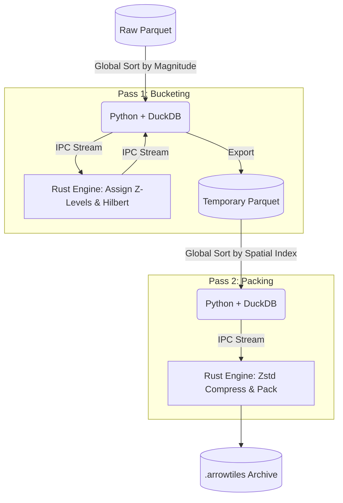

# ArrowTiles Pipeline (DuckDB + Rust IPC)

[](https://duckdb.org)
[](https://www.rust-lang.org/)
[](https://www.python.org/)

ArrowTiles is a high-performance data engineering pipeline designed to process massive, out-of-core spatial datasets (like the 1.8 billion row ESA Gaia dataset) and pack them into strictly ordered, Apache Arrow IPC-encoded `.arrowtiles` (PMTiles) archives.

Because statically compiling a DuckDB extension via Rust on Windows can cause MSVC standard library conflicts, this pipeline uses a **Native Python Extension (PyO3)** architecture. Python orchestrates DuckDB's out-of-core sorting engine, while the `arrowtiles_core` Rust module is directly imported into Python to handle CPU-intensive spatial math and parallel Zstandard compression with zero-overhead FFI bindings.

## 🚀 Performance
The 2-pass IPC architecture completely bypasses FFI (Foreign Function Interface) memory leaks and maximizes CPU utilization. It is capable of processing **1.35 billion rows (~25 GB raw Parquet)** on consumer hardware (64GB RAM, 24-core CPU) in approximately **50 minutes**, yielding a tightly compressed 15.8 GB `.arrowtiles` archive optimized for WebGPU HTTP Range Requests.

## 🏗️ The 2-Pass Architecture

To prevent out-of-memory (OOM) crashes and preserve 60 FPS rendering in the frontend browser, the pipeline strictly separates spatial indexing from chunk compression:



### Pass 1: Global Magnitude Bucketing
1. DuckDB reads the raw dataset and sorts it globally by absolute magnitude (brightness) in ascending order.
2. The ordered rows are piped to the Rust engine, which uses a density map to assign a Quadtree Z-level and a spatial Hilbert index to each point.
3. The enriched rows are streamed back to DuckDB and saved as a temporary Parquet file (`duckdb_temp/bucketed_temp.parquet`).

### Pass 2: Spatial IPC Packing
1. DuckDB reads the temporary Parquet file and sorts it globally by `Z-Level` and `Hilbert Index`.
2. The perfectly ordered spatial data is piped to the Rust engine.
3. Rust strips the redundant Arrow IPC schema headers (saving ~12% archive size), parallelizes Zstd compression across all CPU cores using Rayon, and limits chunks to 500k rows to prevent client-side memory spikes.
4. Rust injects the base64-encoded Arrow schema into the final PMTiles JSON metadata.

---

## 🛠️ Building & Setup

### 1. Prerequisites
- **Python 3.10+**
- **Rust Toolchain** (cargo)
- **DuckDB CLI** (or Python package)

### 2. Python Environment
Install the required python orchestration dependencies (`pyarrow`, `duckdb`, `tqdm`):
```bash
pip install -r requirements.txt
```

### 3. DuckDB Extensions
This pipeline relies on the community `lindel` extension for Hilbert curve generation. You can install it directly inside your DuckDB environment:
```sql
INSTALL lindel FROM community;
LOAD lindel;
```

### 4. Build the Rust Engine (PyO3)
The high-performance Rust engine is bound to Python via PyO3. You must compile the extension in release mode using `maturin` to achieve acceptable throughput:
```bash
pip install maturin
cd arrowtiles-engine
maturin develop --release
```
*(This compiles the Rust engine and installs it into your active Python environment as `arrowtiles_core`)*

---

## ⚙️ Usage & Configuration

Once the Rust binary is compiled, you execute the Python orchestrator to begin the 2-pass build process:

```bash
python arrowtiles.py --input "path/to/raw/*.parquet" --output "gaia.arrowtiles"
```

### CLI Arguments
| Argument | Description |
| :--- | :--- |
| `--input` | (Required) Glob path to the input Parquet files. |
| `--output` | (Required) Path where the final `.arrowtiles` archive will be written. |
| `--config` | (Optional) Path to a JSON configuration file defining custom schema mappings. |
| `--temp-dir` | (Optional) Path for intermediate DuckDB data. Defaults to `./duckdb_temp`. |
| `--resume` | (Optional) Skips Pass 1 and resumes directly from the `bucketed_temp.parquet` file. |

### Input Data Requirements
The pipeline is a **generalized data visualizer**. When running the `build_generic` pipeline, DuckDB automatically inspects your dataset's schema, identifies all numeric columns, and runs global `MIN()` and `MAX()` aggregations to establish automatic bounding stats. 

These stats are serialized into a custom JSON metadata block and injected directly into the `.arrowtiles` archive, allowing frontend GUIs to dynamically generate sliders and coordinate scales for *any* dataset.

**Gaia Baseline Mode**: By default, the engine includes a specialized projection mode for the ESA Gaia dataset, expecting `ra`, `dec`, and `magnitude` columns for advanced Galactic Hammer projections.

---

## 🗺️ Future Roadmap

While the core pipeline successfully processes billion-row datasets, there are several major architectural leaps planned to transform ArrowTiles from a sandbox tool into a world-class spatial ecosystem.

### Phase 1: Pipeline & Frontend Optimization
- **Z-Level Partitioning (Zero-Wait Packing):** Currently, Pass 2 requires a 20-minute out-of-core spatial sort by DuckDB. We plan to upgrade Pass 1 to partition data into separate Parquet files based on Zoom level (`z_0.parquet`, `z_1.parquet`). This perfectly pre-sorts the Z-axis, turning Pass 2 into a series of lightning-fast, purely in-memory sorts and eliminating the disk-thrashing gap.
- **Multi-Tile Streaming (Layering):** Packing 10 dimensions of scientific data (Velocity, Chemistry, Dust) into a single file makes the `.arrowtiles` archive extremely heavy. We will upgrade the pipeline to generate a lightweight "Core Layer" (XYZ coordinates only) alongside independent "Auxiliary Layers". The frontend WebWorker will fetch active layers concurrently and merge them just-in-time before GPU upload, drastically reducing bandwidth and allowing users to dynamically toggle datasets.

### Phase 2: Open-Source Ecosystem Wrappers
To make the pipeline accessible to the broader data science and web development communities, we plan to wrap the unified Rust engine using industry-standard FFI bindings:
- **✅ Completed (PyO3 + Maturin):** The Rust engine is now natively bound to Python, allowing data scientists to generate tiles directly in Jupyter Notebooks without subprocess overhead.
- **Node.js CLI (NAPI-RS):** Publish to NPM so web developers can quickly generate test tiles for WebGPU frontends using a simple terminal command: `npx arrowtiles build <input> <output>`.

### Phase 3: The C++ DuckDB Extension
Once the byte-offset logic, Quadtree math, and schema-stripping algorithms are mathematically perfected and proven in safe Rust, the ultimate goal is to port the logic to C++. By building a native loadable DuckDB extension, anyone in the world will be able to generate WebGPU-ready tiles using standard SQL:

```sql
INSTALL arrowtiles;
LOAD arrowtiles;
COPY (
    SELECT ra, dec, parallax, phot_g_mean_mag 
    FROM 's3://esa-gaia/**/*.parquet'
) TO 'gaia.arrowtiles' (FORMAT ARROWTILES, MAX_CAPACITY 100000);
```

---

## 📄 Licensing
This project is freely available for non-commercial use under the **Creative Commons Attribution Non Commercial CC BY-NC 4.0** public license. Please note that this license does not permit commercial use of the software. For more information about the limitations of this license, you can refer to the [CC BY-NC 4.0 License Deed](https://creativecommons.org/licenses/by-nc/4.0/).

If you’re planning to use this software commercially, please reach out to us for a Business license.
