# ArrowTiles (DuckDB Rust Extension)

[](https://duckdb.org)
[](https://www.rust-lang.org/)

ArrowTiles is a highly experimental, high-performance **native DuckDB extension** written in Rust. 

The goal of this project is to eliminate Python and standard IPC overhead from spatial tiling workflows. By running directly inside DuckDB's C++ memory space, ArrowTiles allows data scientists to ingest massive Parquet/CSV datasets and natively export them into a single PMTiles archive filled with zero-copy Apache Arrow IPC buffers—all using a single SQL command.

## 🏗️ Architecture

ArrowTiles leverages `duckdb-rs` and `cargo-duckdb-ext-tools` to bridge the gap between DuckDB's internal C++ execution engine and the modern Rust geospatial ecosystem (`arrow-rs` and `pmtiles-rs`).

```mermaid
graph TD
    A[(Massive Dataset\nParquet/CSV)] -->|SQL COPY / SELECT| B(DuckDB C++ Engine)
    
    subgraph "ArrowTiles Extension (Rust cdylib)"
        B -->|FFI C-Data Interface| C[DataChunks / Vectors]
        C -->|Zero-Copy / Memory Map| D[Apache Arrow RecordBatches]
        D -->|arrow_ipc::writer| E[Arrow IPC Byte Buffers]
        E -->|fast_hilbert| F[Spatial Binning Z/X/Y -> TileID]
        F -->|pmtiles_writer| G[PMTiles Directory Packaging]
    end
    
    G --> H[(output.pmtiles)]
    
    classDef duckdb fill:#ff9900,stroke:#333,stroke-width:2px;
    classDef rust fill:#000000,stroke:#fff,stroke-width:2px,color:#fff;
    class B duckdb;
    class C,D,E,F,G rust;
```



## 🚀 Phases & Roadmap

### ✅ Phase 1: Extension Skeleton & DuckDB Interop (Completed)
- [x] Initialized a standard Cargo `cdylib` library.
- [x] Crossed the C ABI boundary using the `#[duckdb_entrypoint_c_api]` macro to allow DuckDB's C++ engine to natively invoke our Rust code.
- [x] Successfully compiled the `.dll` and injected DuckDB's strict cryptographic metadata footer using `cargo-duckdb-ext-tools`.
- [x] Extension loads flawlessly in DuckDB (`LOAD 'arrowtiles'`) without IPC or Python bridging.

### ✅ Phase 2: Arrow Serialization (Completed)
- [x] Hooked into DuckDB's internal vectors by creating a custom `TableFunction` (`arrowtiles_export`).
- [x] Implemented a **Thread-Safe Channel Architecture**: Bypassed DuckDB's parallel worker thread constraints by spawning a dedicated background worker that exclusively holds the `Connection`, communicating with the `VTab` via `mpsc` channels.
- [x] Extracted `RecordBatch` streams using DuckDB's highly optimized Arrow C-Data interface (`stmt.query_arrow([])`).
- [x] Serialized zero-copy batches directly into an Apache Arrow IPC `.feather` output file using `arrow::ipc::writer::FileWriter`.

### 🗺️ Phase 3: Spatial Binning & PMTiles Packaging
- [ ] Implement spatial quadtree math to determine Z/X/Y bounds for every row.
- [ ] Convert Z/X/Y coordinates into Hilbert Curve `TileId`s using `fast_hilbert`.
- [ ] Feed the Arrow IPC buffers into `pmtiles-rs` to construct the PMTiles directory structure.
- [ ] Flush the final `.pmtiles` archive to disk.

## ⚠️ Known Limitations

- **Temporary Tables & Uncommitted Transactions**: Because DuckDB requires Table Functions to be completely thread-safe, `arrowtiles_export` passes your query to an isolated background connection worker. This means the extension cannot currently export `TEMP` tables or data from uncommitted transactions. Please ensure you are querying physical tables or persistent views!
- **Sequential Execution**: The extension utilizes a single background worker to prevent Out-Of-Memory (OOM) crashes when attempting concurrent exports of massive geospatial datasets. Multiple concurrent `arrowtiles_export` calls will be queued and executed sequentially.

## 🛠️ Building & Loading

### Prerequisites
* Rust toolchain (cargo)
* `cargo-duckdb-ext-tools`

```bash
# Install the extension packaging tool
cargo install cargo-duckdb-ext-tools

# Build the extension with the required metadata footer
cargo duckdb-ext build -- --release
```

### Usage

Open your DuckDB CLI or Python environment and load the extension:

```sql
LOAD 'target/release/duckdb_arrowtiles.duckdb_extension';
```
