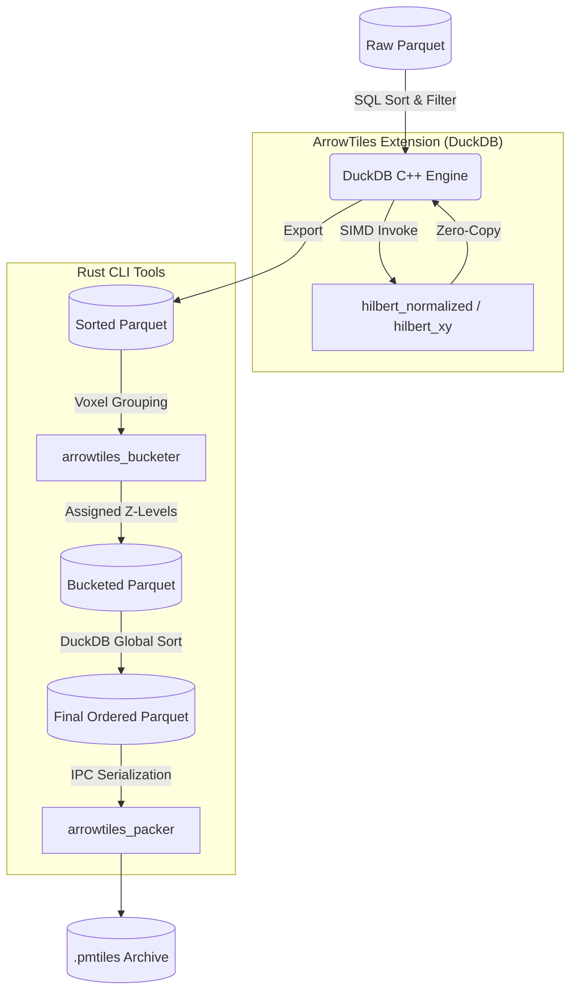

# ArrowTiles Toolkit (DuckDB Extension + Rust CLI)

[](https://duckdb.org)
[](https://www.rust-lang.org/)

ArrowTiles is a high-performance toolkit written in Rust for processing massive spatial datasets and packing them into Apache Arrow IPC-encoded PMTiles archives.

It consists of two main components:
1. **Native DuckDB Extension:** Blazingly fast, SIMD-accelerated scalar UDFs (like Hilbert Curve generation) that evaluate across billions of rows in DuckDB with zero serialization overhead.
2. **Rust CLI Tools:** Standalone binaries (`arrowtiles_bucketer` and `arrowtiles_packer`) that handle out-of-core spatial voxel bucketing and PMTiles archive generation.

## 🏗️ Architecture

The ArrowTiles pipeline is designed to process data much larger than RAM by leveraging DuckDB for sorting, and highly optimized Rust streams for bucketing and packaging.



## 🚀 The CLI Tools

In addition to the DuckDB extension, building this project yields two CLI executables in `target/release/`:

### 1. `arrowtiles_bucketer`
Reads a raw spatial Parquet file, groups points into spatial voxels based on a grid size, and resolves the hierarchical Quadtree Z-level for each point to prevent visual overcrowding.
**Usage:** `arrowtiles_bucketer <input.parquet> <output.parquet> <grid_size> <max_zoom>`

### 2. `arrowtiles_packer`
Reads a Parquet file strictly ordered by `final_tile_id`, serializes the chunks into Apache Arrow IPC format, compresses them with Zstd, and writes a compliant `.pmtiles` archive.
**Usage:** `arrowtiles_packer <input_sorted.parquet> <output.pmtiles>`

## 🛠️ Building & Loading

### Prerequisites
* Rust toolchain (cargo)
* `cargo-duckdb-ext-tools`

```bash
# Install the extension packaging tool
cargo install cargo-duckdb-ext-tools

# Build the DuckDB extension and the CLI binaries
cargo duckdb-ext build -- --release
```

### Usage

Open your DuckDB CLI or Python environment and load the extension:

```sql
LOAD 'target/release/arrowtiles.duckdb_extension';
```

### Available UDFs

#### 1. `hilbert_normalized(x_norm, y_norm, zoom)`
Generates a standard Hilbert Curve index (PMTiles Z-order compatible) from pre-normalized coordinates.

> [!WARNING]
> **Strict Typing Required:** DuckDB's exact-match signature resolution requires the input coordinates to be strictly typed as `DOUBLE` (Float64) and zoom as `UTINYINT`.

```sql
SELECT 
    data.*,
    hilbert_normalized(data.x_norm::DOUBLE, data.y_norm::DOUBLE, 14::UTINYINT) AS tile_id
FROM spatial_data AS data
```

#### 2. `hilbert_xy(lon, lat, zoom)`
Projects raw WGS84 Longitude/Latitude coordinates into Web Mercator space and generates the corresponding Hilbert Curve index.

```sql
SELECT 
    data.*,
    hilbert_xy(data.lon::DOUBLE, data.lat::DOUBLE, 14::UTINYINT) AS tile_id
FROM spatial_data AS data
```
